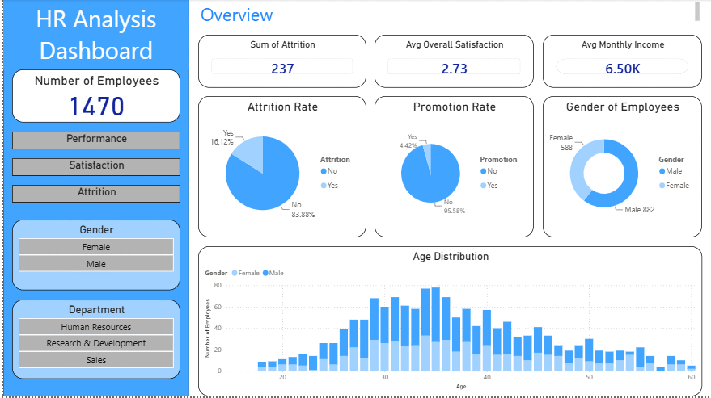

# HR Analysis Dashboard | Attrition, Performance & Employee Satisfaction

An interactive HR analytics dashboard built in Power BI using the IBM HR Analytics Employee Attrition dataset. Designed to help HR decision makers and business leaders understand workforce trends, identify attrition risks, and evaluate employee satisfaction and compensation patterns across the organisation.

---

## Dashboard Preview

---

## Files in This Repository

| File | Description |
|------|-------------|
| `HR_Analaysis.pbix` | Power BI Desktop file with all four report pages |
| `capture_hr_dashboard.gif` | Animated demo of the dashboard in action |

---

## Dashboard Pages

### 1. Overview
High level snapshot of the workforce including:
- Total headcount: 1,470 employees
- Attrition count: 237 (16.12% attrition rate)
- Average overall satisfaction: 2.73 (Medium to High)
- Average monthly income: $6.50K
- Promotion rate: 4.42%
- Gender distribution: 882 Male, 588 Female
- Age distribution by gender (clustered column chart)

### 2. Performance and Compensation
Explores the relationship between tenure, education, and earnings:
- Average monthly income by department (treemap)
- Education vs income: income increases from Below College through to Doctoral level
- Tenure vs performance scatter plot
- Compensation vs performance scatter plot

### 3. Employee Satisfaction and Engagement
Analyses workforce wellbeing across four dimensions:
- Work life balance score distribution
- Job involvement breakdown
- Overtime impact on satisfaction scores
- Average satisfaction score by department

### 4. Attrition and Work Patterns
Investigates attrition behaviour in context:
- Attrition rate donut chart
- Gender breakdown donut chart
- Distance from home vs attrition scatter plot

---

## Dataset

**Source:** IBM HR Analytics Employee Attrition and Performance dataset

**Records:** 1,470 employees across three departments (Human Resources, Research and Development, Sales)

### Encoded Column Reference

| Column | Encoding |
|--------|----------|
| Education | 1 = Below College, 2 = College, 3 = Bachelor, 4 = Master, 5 = Doctor |
| Environment Satisfaction | 1 = Low, 2 = Medium, 3 = High, 4 = Very High |
| Job Involvement | 1 = Low, 2 = Medium, 3 = High, 4 = Very High |
| Job Satisfaction | 1 = Low, 2 = Medium, 3 = High, 4 = Very High |
| Performance Rating | 1 = Low, 2 = Good, 3 = Excellent, 4 = Outstanding |
| Relationship Satisfaction | 1 = Low, 2 = Medium, 3 = High, 4 = Very High |
| Work Life Balance | 1 = Bad, 2 = Good, 3 = Better, 4 = Best |

---

## Technical Details

- Built in Power BI Desktop
- DAX calculated columns used to convert Attrition and Promotion fields from categorical Yes/No to numeric values for aggregation
- Cross page slicers for Gender and Department filter all visuals simultaneously
- Bookmark navigation buttons on the sidebar enable seamless page switching
- Custom sidebar design with layered shapes, tile style slicers, and a consistent blue colour theme across all four pages

---

## Tools Used

- Power BI Desktop
- DAX (Data Analysis Expressions)
- IBM HR Analytics Dataset

---

## Author

**Ayodeji Jakande**

[LinkedIn](https://www.linkedin.com/in/ayodeji-jakande-5a4054325/)
